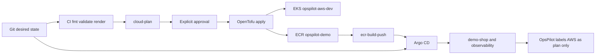

# Phase 7 runbook — AWS dev and GitOps

Local k3d does not use this runbook. `infra/scripts/up-dev-cluster.sh` still builds `opspilot-dev`.

## Observed account

A console `aws login` session can read this account. The profile stores a login session and `region = us-east-1`. It does not store an access key. The free-plan API reported an active free plan and credits. Credits are not approval to apply the EKS stack. Cost Explorer is not enabled, so this runbook does not quote a billed dollar total from Cost Explorer.

Notification-only AWS Budgets are free. Budget actions and budget reports are not. No budget was created here because the account contact record has no email address and no billing alternate contact. An alert with nowhere to send is not an alert. Alerts do not stop resources by themselves.

## Zero-cost stop

The default portfolio path does not apply this stack. Amazon EKS, the managed node, public IPv4, and ECR can charge the account. Official EKS pricing is $0.10 per cluster-hour on standard support. This environment could not read the account plan or credit balance, so those prices are not assumed to be covered.

```bash
infra/scripts/cost-classify
```

That command exits non-zero while the billable resources remain. `cloud-apply`, `ecr-build-push`, and `argocd-bootstrap` call the same check and refuse before AWS. `OPSPILOT_CLOUD_APPROVED=yes` does not bypass it. `OPSPILOT_PAID_CLOUD_OVERRIDE` is not set and must not be set for a $0 demonstration.

The steps below describe the paid path only. Do not run them for the portfolio demo. The live reliability lab is local k3d plus `gitops/overlays/local`.

The public AWS console is a different stack, `infra/aws-zero-cost`. It is one Lambda function URL, an execution role that can write only that function's log stream, and a one-day CloudWatch log group. Apply it only through `scripts/aws-zero-cost-deploy.sh` after `OPSPILOT_ZERO_COST_DEPLOYMENT=yes`. That flag does not authorize EKS. `scripts/aws-cost-status.sh` is read-only. Credit emails are not spending caps. See [ADR 0028](../adr/0028-aws-zero-cost-portfolio.md).



## Prerequisites

- AWS CLI credentials for the portfolio account, via the normal provider chain. Do not put keys in Git, tfvars that are committed, or the investigator.
- OpenTofu 1.12.6, kubectl, docker, and kustomize.
- A copy of `infra/terraform/environments/dev/dev.auto.tfvars.example` named `dev.auto.tfvars`.
- Set `aws_region`, `allowed_regions`, and `allowed_account_id` to the real account. `000000000000` is rejected.
- Set `api_cidrs` to your current public address as a `/32`. `0.0.0.0/0` is rejected.
- Export `AWS_REGION` to the same region.

## Identity

```bash
infra/scripts/cloud-doctor
```

This prints the account, role ARN, and region. It does not create resources. If credentials are missing it exits 2.

## Plan and cost review

```bash
infra/scripts/cloud-plan
```

Read the plan before any apply. The standing costs are the EKS control plane at the standard-support rate, one `t3.medium`, a 20 GiB volume, and one public IPv4 address. There is no NAT gateway.

## Approval

`cloud-apply` does not run unless `OPSPILOT_CLOUD_APPROVED=yes` is set for that command. A previous conversation, a plan file, or a successful doctor check is not approval.

## Apply

```bash
OPSPILOT_CLOUD_APPROVED=yes infra/scripts/cloud-apply
```

## Images

```bash
OPSPILOT_CLOUD_APPROVED=yes infra/scripts/ecr-build-push
```

Then replace `ecr.invalid/opspilot-demo` in `gitops/overlays/aws-dev/kustomization.yaml` with the repository URL and commit that desired state.

## Argo CD

```bash
export OPSPILOT_GITOPS_REPO=<git url Argo can read>
OPSPILOT_CLOUD_APPROVED=yes infra/scripts/argocd-bootstrap
kubectl -n argocd port-forward svc/argocd-server 8443:443
```

The initial password is `argocd-initial-admin-secret` in the cluster. Do not commit it. Confirm the app is Synced and Healthy:

```bash
infra/scripts/gitops-status
```

## Observability

Prometheus, the collector, Jaeger, Grafana, and Alertmanager come from the same base as the local cluster. Reach them with `kubectl -n opspilot-system port-forward`. Do not add a load balancer.

Leave `OPSPILOT_K8S_CLUSTER` unset so the console stays on local k3d and shows `LOCAL — LIVE`. Do not point the API at `opspilot-aws-dev` to imitate a deployment. The infrastructure page reads `GET /api/v1/cloud/status`, which masks the account id and always reports EKS as plan-only. The executor still refuses `opspilot-aws-dev`.

## Drift

```bash
infra/scripts/gitops-drift-demo
```

The script adds one replica to `payment-api`, expects Argo to report the drift, syncs the Git replica count, and turns self-heal back on.

## Destroy

```bash
infra/scripts/cloud-doctor
OPSPILOT_CLOUD_APPROVED=yes OPSPILOT_CLOUD_DESTROY=yes infra/scripts/cloud-destroy
```

The script prints the account, region, and resource set, deletes OpsPilot dev load balancers if any exist, then destroys this state. Confirm with `cloud-status` that the cluster and repository are gone.
